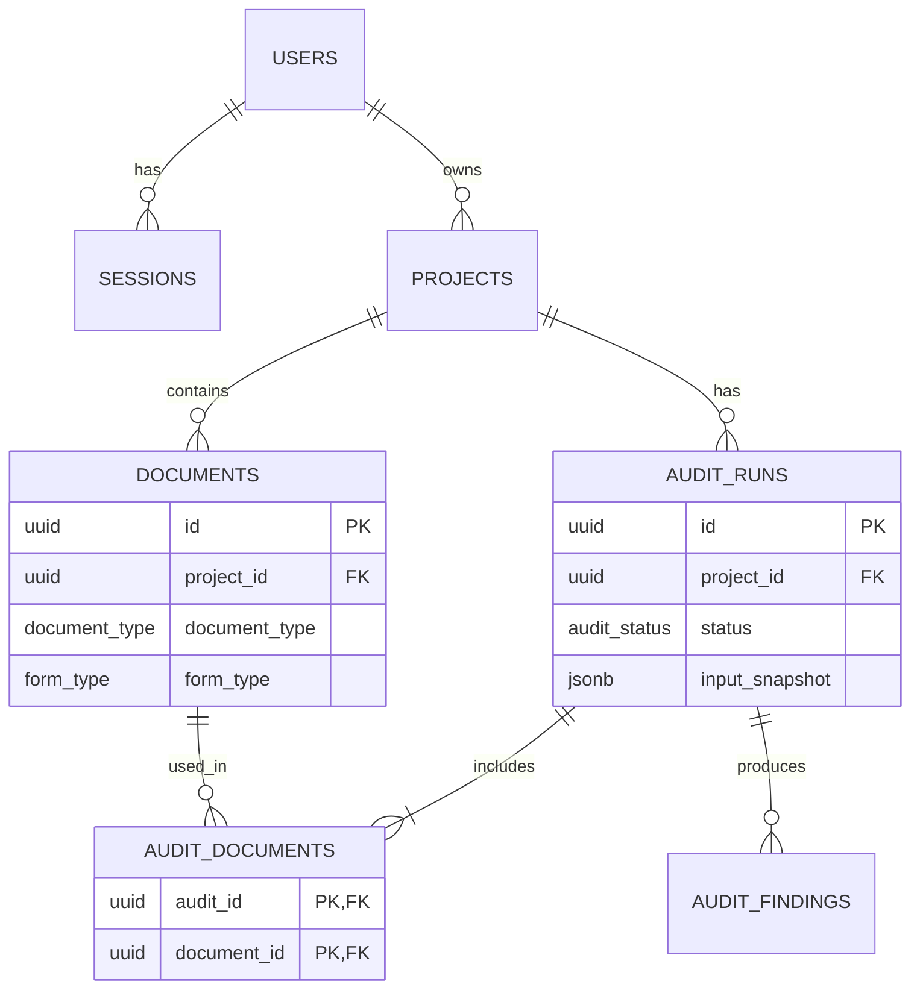
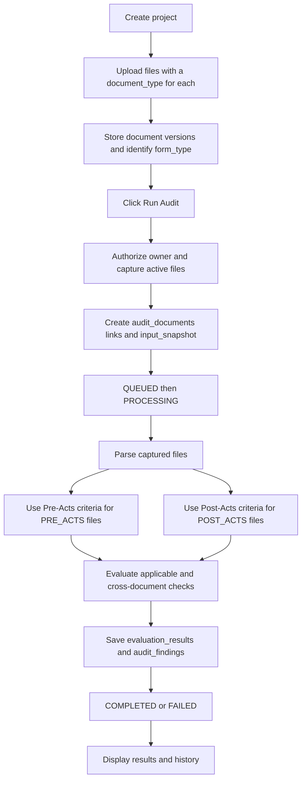

# Check Republic API — Checklist MVP Data Model

This proposed **seven-table PostgreSQL model** supports the audit workflow in [spec.md](./spec.md). [data-model.dbml](./data-model.dbml) contains the matching schema. These documents describe the design; they do not implement migrations or APIs.

The MVP uses [Pre-Acts](./pre-acts-checklist.md) and [Post-Acts](./post-acts-checklist.md) checklists as repository-maintained audit criteria. Each uploaded document has a user-selected `document_type`: PRE_ACTS or POST_ACTS. One project can contain both groups. An audit run checks the project's active documents using their classifications; it has no document-type field or separate phase selector.

Accounts, packages, files, run membership, and findings belong in the database. Checklist content and reviewed item identities stay in the repository, with the applicable editions captured for each run.

## 1. Types and relationships

```sql
CREATE TYPE document_type AS ENUM (
    'PRE_ACTS', 'POST_ACTS'
);
CREATE TYPE audit_status AS ENUM (
    'QUEUED', 'PROCESSING', 'COMPLETED', 'FAILED'
);
CREATE TYPE audit_result AS ENUM (
    'READY', 'NEEDS_REVISION', 'BLOCKED', 'INCOMPLETE'
);
CREATE TYPE form_type AS ENUM (
    'A_FORM', 'PPR', 'AR', 'SAS', 'GALS', 'LOP', 'MOA', 'LOE', 'NE', 'FRS', 'PUBLICITY', 'EVALUATION', 'OTHER', 'UNKNOWN'
);
CREATE TYPE evaluation_outcome AS ENUM (
    'PASS', 'FAIL', 'NOT_APPLICABLE', 'NOT_EVALUATED', 'NEEDS_MANUAL_REVIEW'
);
CREATE TYPE finding_severity AS ENUM (
    'BLOCKING', 'WARNING', 'INFO'
);
```

`documents.document_type` is the user's Pre-Acts/Post-Acts selection for each file; `form_type` identifies A-Form, PPR, AR, and other forms. Execution status, evaluation outcome, and issue severity have different meanings. JSONB evaluation outcomes use the same vocabulary as `evaluation_outcome`; application validation is required because PostgreSQL does not enforce enums inside JSONB.

| Attribute       | Example         | Meaning                                                         |
| :-------------- | :-------------- | :-------------------------------------------------------------- |
| `document_type` | PRE_ACTS        | Which checklist group the file belongs to; selected by the user |
| `form_type`     | PPR             | Which activity form the file contains; recognized or confirmed  |
| `mime_type`     | application/pdf | The validated file format                                       |

For example, an approved A-Form included for an AR comparison remains `document_type = PRE_ACTS` and `form_type = A_FORM`. Using it as a Post-Acts reference does not change its classification or establish approval by itself.



## 2. Minimal entities

UUID primary keys default to `gen_random_uuid()`. All fields are required unless marked nullable. Foreign keys use ON DELETE RESTRICT. Owner access is resolved through `projects.user_id`; documents and runs do not duplicate the owner.

### `users`

Stores the verified institutional Google account. The user owns projects, which determine access to their documents, runs, and findings.

| Column           | Type / constraints                               | Purpose                      |
| :--------------- | :----------------------------------------------- | :--------------------------- |
| `id`             | `uuid`; pk, not null, default: gen_random_uuid() | User ID                      |
| `google_subject` | `text`; not null, unique                         | Verified Google subject      |
| `email`          | `varchar(255)`; not null, unique                 | Verified institutional email |
| `full_name`      | `varchar(255)`; not null                         | Display name                 |

### `sessions`

Stores an expiring login session. Sign-out deletes the session; protected endpoints reject expired or missing sessions.

| Column               | Type / constraints                               | Purpose                   |
| :------------------- | :----------------------------------------------- | :------------------------ |
| `id`                 | `uuid`; pk, not null, default: gen_random_uuid() | Session ID                |
| `user_id`            | `uuid`; not null                                 | FK → users.id             |
| `refresh_token_hash` | `text`; not null                                 | Hashed refresh credential |
| `expires_at`         | `timestamptz`; not null                          | Server-enforced expiry    |

### `projects`

Groups all documents for one event, including Pre-Acts and Post-Acts files. `revision` changes when the name, attachments, `document_type`, or `form_type` changes, allowing older results to be marked outdated.

| Column     | Type / constraints                               | Purpose                                                                                    |
| :--------- | :----------------------------------------------- | :----------------------------------------------------------------------------------------- |
| `id`       | `uuid`; pk, not null, default: gen_random_uuid() | Package ID                                                                                 |
| `user_id`  | `uuid`; not null                                 | FK → users.id; package owner                                                               |
| `name`     | `varchar(255)`; not null                         | Required nonempty Project/Event Name                                                       |
| `revision` | `bigint`; not null, default: 1                   | Positive input revision; increment on name, attachment, document_type or form_type changes |

### `documents`

Stores one uploaded file version. Require `document_type` for each file when uploading; a multi-file upload can include different selections. The user may correct `document_type` later. Keep `form_type = UNKNOWN` when the specific form cannot be identified reliably, and request confirmation or report manual review.

File bytes and `storage_key` are immutable. Replacing a file creates a new row/object and marks the previous attachment `is_deleted`; changing a classification updates its metadata and increments the project revision. Neither operation modifies classifications or membership captured by existing runs.

| Column          | Type / constraints                               | Purpose                                                         |
| :-------------- | :----------------------------------------------- | :-------------------------------------------------------------- |
| `id`            | `uuid`; pk, not null, default: gen_random_uuid() | Immutable uploaded file version                                 |
| `project_id`    | `uuid`; not null                                 | FK → projects.id                                                |
| `document_type` | `document_type`; not null                        | User-selected PRE_ACTS or POST_ACTS document group              |
| `form_type`     | `form_type`; not null, default: 'UNKNOWN'        | Recognized/confirmed form; UNKNOWN needs confirmation or review |
| `filename`      | `text`; not null                                 | Original client filename                                        |
| `mime_type`     | `varchar(128)`; not null                         | Validated PDF/DOCX/XLSX MIME type                               |
| `size_bytes`    | `bigint`; not null                               | Positive; maximum 25 MB per file                                |
| `storage_key`   | `text`; not null, unique                         | Private Garage object key                                       |
| `is_deleted`    | `boolean`; not null, default: false              | Removed/replaced attachment; retain historical object           |

### `audit_runs`

Stores one manual execution for the project. When Run Audit is clicked, include its active valid documents and capture their `document_type` values. Checklist selection comes from those captured values, rather than a run-level setting. `status` tracks processing; `overall_result` summarizes completed evaluations.

| Column               | Type / constraints                               | Purpose                                                                                          |
| :------------------- | :----------------------------------------------- | :----------------------------------------------------------------------------------------------- |
| `id`                 | `uuid`; pk, not null, default: gen_random_uuid() | Run ID                                                                                           |
| `project_id`         | `uuid`; not null                                 | FK → projects.id                                                                                 |
| `status`             | `audit_status`; not null, default: 'QUEUED'      | Execution lifecycle                                                                              |
| `input_snapshot`     | `jsonb`; not null                                | Frozen document versions/types, applicable checklist editions, project name/revision and context |
| `evaluation_results` | `jsonb`; not null, default: '[]'::jsonb          | Checklist outcomes/evidence, parser issues and review gaps                                       |
| `overall_result`     | `audit_result`; null                             | Summary only for COMPLETED runs                                                                  |
| `error_message`      | `text`; null                                     | Sanitized fatal error; name failing input where known                                            |
| `created_at`         | `timestamptz`; not null, default: now()          | Queue time                                                                                       |
| `completed_at`       | `timestamptz`; null                              | Terminal time for COMPLETED or FAILED                                                            |

### `audit_documents`

| Column        | Type / constraints                   | Purpose                            |
| :------------ | :----------------------------------- | :--------------------------------- |
| `audit_id`    | `uuid`; not null; FK → audit_runs.id | Audit run                          |
| `document_id` | `uuid`; not null; FK → documents.id  | Exact file version used by the run |

The pair `(audit_id, document_id)` is the primary key. This is the explicit many-to-many link between runs and documents: one run checks several files, and the same file version can participate in several runs. Index `document_id` for reverse lookups and retention checks.

Create these links atomically with the run and snapshot, with at least one document. Validate that each linked document belongs to the run's project. Membership is immutable after creation; the document IDs in `input_snapshot` must match the linked set. Foreign keys prevent hard deletion of referenced file records; application retention checks preserve their stored bytes.

### `audit_findings`

Stores actionable issues from a run. One finding may involve several files through `locations`, or no uploaded file when a required document is missing. Its checklist citation and evaluation outcome come from the captured inputs and results, not the documents' current classifications.

| Column           | Type / constraints                               | Purpose                                                                                                      |
| :--------------- | :----------------------------------------------- | :----------------------------------------------------------------------------------------------------------- |
| `id`             | `uuid`; pk, not null, default: gen_random_uuid() | Finding ID                                                                                                   |
| `audit_id`       | `uuid`; not null                                 | FK → audit_runs.id                                                                                           |
| `outcome`        | `evaluation_outcome`; not null                   | FAIL, NOT_EVALUATED or NEEDS_MANUAL_REVIEW                                                                   |
| `severity`       | `finding_severity`; null                         | Reviewed severity for FAIL; null for uncertainty                                                             |
| `reason`         | `text`; not null                                 | Problem and supporting explanation                                                                           |
| `recommendation` | `text`; not null                                 | Concrete correction or review action                                                                         |
| `reference`      | `jsonb`; null                                    | Captured checklist filename/hash, section/item ID, triggering scope/context; null for parser/coverage issues |
| `locations`      | `jsonb`; not null, default: '[]'::jsonb          | Affected snapshotted document IDs with section/field and optional reliable positions                         |

Index session/project owner lookups, active project attachments, project run history, and finding run lookups. Prevent concurrent duplicate starts with the following PostgreSQL index (a note in DBML, since partial indexes are not represented there):

```sql
CREATE UNIQUE INDEX audit_runs_one_active_per_project
ON audit_runs (project_id)
WHERE status IN ('QUEUED', 'PROCESSING');
```

## 3. Snapshot, evaluations, and findings

**`input_snapshot` preserves what the run checked.** It contains:

- The project name and revision at start.
- Exact document IDs, immutable storage keys, filenames, form types, and per-document `document_type` selections.
- The applicable checklist editions: filenames, content hashes, captured text, and reviewed item identities/applicability/severity used for evaluation. Capture Pre-Acts criteria for PRE_ACTS files and Post-Acts criteria for POST_ACTS files; a mixed package may use both.
- Confirmed or unknown applicability and approval evidence used by this run, with review gaps where necessary.

Checklist item IDs identify requirements within a captured edition; filename/hash plus section/item identifies the version. Scope is recorded as global, form-specific, or cross-document in the captured criteria and finding reference. No rules table, source registry, publishing workflow, or evaluator registry is needed.

Freeze the snapshot and `audit_documents` membership under a package lock and consistent transaction before queueing work. The link table records which file versions were used; the snapshot preserves their `document_type`, `form_type`, and checklist/context as they were at start. Workers use captured values even if a file is later relabeled or replaced. Snapshots reference uploaded bytes rather than duplicate them. If uncertain applicability is resolved during extraction, retain that decision and evidence in evaluation results without rewriting the original snapshot.

**`evaluation_results` records coverage.** Each entry identifies the captured checklist edition/item and affected file/partner/package, with outcome, reason, evidence, and applicability decision. A mixed run keeps Pre-Acts and Post-Acts evaluations distinguishable through their source references and captured document types. Retain PASS and NOT_APPLICABLE as well as failures and uncertainty. Parser issues and unresolved review gaps are recorded explicitly. Complete runs cover every selected criterion; empty coverage cannot yield READY.

**`audit_findings` contains actionable issues.** FAIL requires a reviewed criterion and its allowed severity. Review outcomes have null severity. A checklist finding references its captured filename/hash, section/item and triggering scope/context, and corresponds to an evaluation result. Parsing or missing-authority issues may have null reference; explain the limitation rather than invent a citation. PASS and NOT_APPLICABLE remain in evaluation results without issue findings.

Location arrays can contain several documents for a consistency issue or none for a missing-file issue. Validate all document IDs against the run's `audit_documents` links and matching snapshot. Include precise highlights only when extraction positions are reliable; otherwise give document section/field fallbacks. References must open the captured edition or clearly identify that edition if only a newer source is available; never silently link historical findings to changed criteria.

JSONB structure, item identity, same-project link membership, snapshot/link consistency, finding/evaluation consistency, and historical file retention require application validation. `audit_documents` file references are protected by foreign keys; IDs embedded inside JSONB still require validation.

## 4. Audit flow and lifecycle

**Project → upload documents and mark each Pre-Acts/Post-Acts → Run Audit → capture inputs → parse → evaluate applicable checklists → save findings → results.**



1. Verify Google identity, verified email, and institutional hosted-domain/eligibility policy; an email suffix alone is insufficient. Establish an expiring session. Sign-out deletes the session, and every protected request checks it server-side.
2. Create an owner-scoped project with a required event name. For each uploaded document, the user selects PRE_ACTS or POST_ACTS; this selection is required and has no implicit default. Validate PDF/DOCX/XLSX uploads independently, with a 25 MB per-file limit. Invalid uploads preserve valid attachments. Ambiguous form types remain UNKNOWN pending confirmation or review.
3. Upload/replacement/removal never starts an audit. Replacement creates a new row/object and marks the old attachment deleted atomically. Bytes and storage keys are immutable; retain objects referenced by historical snapshots. Package name, attachment, `form_type`, or `document_type` changes increment revision. Authorize access before generating short-lived storage URLs.
4. Explicitly start a run with at least one valid active document. Include the project's active valid documents through `audit_documents` and select applicable criteria from their captured `document_type` values. A PRE_ACTS-only package uses the Pre-Acts checklist; a POST_ACTS-only package uses the Post-Acts checklist and reports missing Pre-Acts references where required; a mixed package uses applicable criteria from both. Keep approved Pre-Acts reference files labeled PRE_ACTS for Post-Acts comparisons, and require approval evidence. Required-file checks apply to represented groups even when a file is absent; they do not require inventing an absent group's classification. Retrieved context must not silently omit mandatory checks.
5. Capture inputs, then transition QUEUED → PROCESSING. Resolve conditions against extractable or confirmed evidence: confirmed false → NOT_APPLICABLE; unknown → NEEDS_MANUAL_REVIEW; unreliable/unsupported evidence → NOT_EVALUATED or NEEDS_MANUAL_REVIEW.
6. Use deterministic checks for readable fields, comparisons, presence, duplicates, and reviewed counting policies. LLM/RAG assistance interprets evidence and proposes explanations using captured criteria. Uploaded text is untrusted evidence and cannot alter instructions. Validate outcomes, severity, evidence, and references before saving.
7. Save evaluations and findings, then finish COMPLETED or FAILED. Recoverable parser errors produce explicit unevaluated outcomes; fatal errors populate a sanitized error message and identify the failing input where possible. Preserve the package. Retry/re-audit creates a separate run from current inputs without requiring re-upload.
8. Display results, coverage, citations, locations, and history. Compare `input_snapshot` project revision with the current project revision to derive `is_outdated`. Show the latest completed run separately from any active run. Terminal runs and findings are immutable.

Completed summary precedence: reviewed blocking failure → BLOCKED; other actionable failure → NEEDS_REVISION; unresolved coverage/manual review → INCOMPLETE; otherwise READY. Informational observations alone do not prevent READY. Return uncertainty alongside any summary. FAILED runs have no readiness result, and READY never means official DocuLogi approval.

The proposed interfaces use document-level classification:

| Operation                 | Inputs / behavior                                                                       | Result                                                                                                            |
| :------------------------ | :-------------------------------------------------------------------------------------- | :---------------------------------------------------------------------------------------------------------------- |
| Upload documents          | File(s) with required `document_type` per file; validate formats and size independently | Stored document metadata and per-file errors                                                                      |
| Correct document metadata | Update `document_type` or confirm `form_type`; authorize the project owner              | Updated classification and incremented project revision                                                           |
| Run Audit                 | Project ID; authorize owner and capture active valid documents                          | Run ID/status; reject a duplicate active start; no separate phase input                                           |
| Read run/history          | Authorize the project owner                                                             | Status/result, represented document groups from the snapshot, evaluations, findings, citations and outdated state |
| Open file/reference       | Authorize file access and respect source permissions                                    | Authorized file access or a reference identifying the captured checklist edition                                  |

Inspector previews support hover, focus, click, and tap. Reliable source anchors are optional. A run's history always displays its captured document groups even after the current files are reclassified.

## 5. Checklist boundaries and acceptance checks

Review criterion applicability, severity, and authority in repository-maintained content before release. File presence does not imply approval. Fixed historical dates/signatories, uncertain external approvals, and conflicting requirements require manual review. Signature-block detection does not authenticate signatures, and uploaded evidence does not establish legal validity or external submission.

The checklists include specialized and termlong activities beyond the current standard single-day synchronous pilot. Evaluate only supported applicable criteria; label unsupported checks explicitly. The 51st Secretaries' Guide and WIP 52nd APS/ADM guides remain reference material for future expansion, not automatic MVP criteria. Later, reviewed guide criteria can use the same snapshot/reference structure without adding rule-management entities.

- **CR-US-01/05/06:** private packages, valid/invalid upload handling, form confirmation, verified institutional sessions, owner isolation, expiry, and sign-out.
- **CR-US-02/03/08:** Pre-/Post-Acts fixtures, cross-form consistency, missing required references/files, conditional tie-up/MOA and other evidence, GALS counting and LOP evidence, unsupported/ambiguous content.
- **CR-US-04:** real checklist versions/item identities, corrections, multi-document and missing-file findings, accessible previews, reliable highlights and section fallbacks.
- **CR-US-07:** manual starts, one active run, fixed inputs despite file/checklist changes, error/retry without re-upload, outdated results, and immutable history.
- Link one file version to multiple runs and several files to one run; reject duplicate pairs and cross-project links. Snapshot membership must match the links, and replacing a file must preserve prior links and stored bytes.
- Require `documents.document_type` with no implicit default. Verify PRE_ACTS-only, POST_ACTS-only, and mixed packages select the corresponding checklist criteria and required-file checks; use Pre-Acts references for Post-Acts comparisons without relabeling them.
- Changing `document_type` increments project revision and marks older results outdated; existing membership, captured labels, evaluations, and findings stay unchanged. New runs use the updated labels.
- Validate JSONB references, outcomes, reviewed severity, and complete checklist coverage. Unknown or unsupported evidence must not produce fabricated failures or READY results.

This change updates documentation only. Database rules/source tables, publishing/approval management, extra owner fields, model/pipeline metadata, separate snapshots, retry links, and extra timestamps are omitted. It adds no migrations, application code, vector tables, guide expansion, document builder, or external submission.
