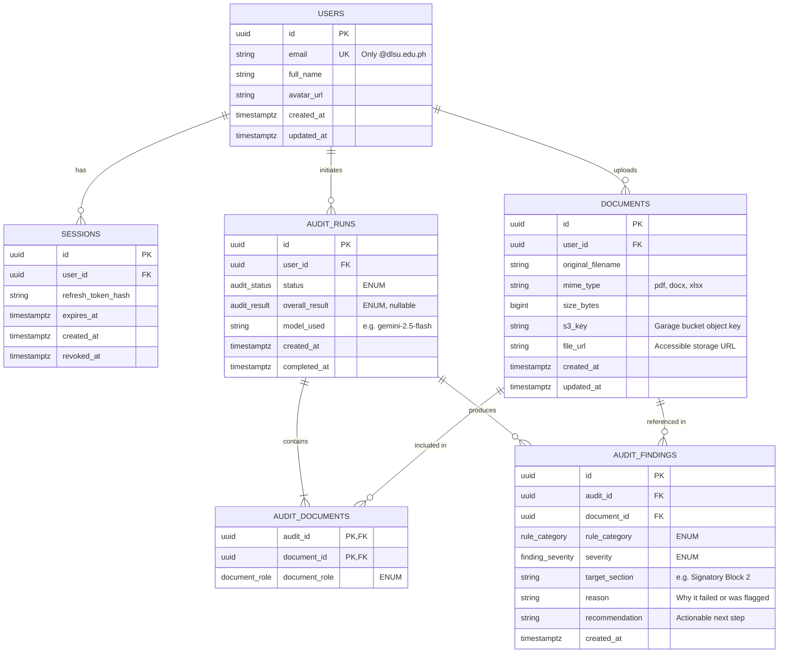
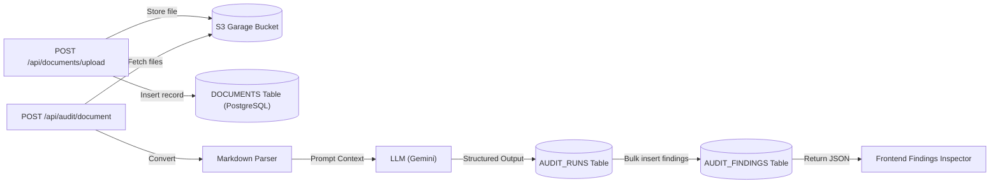

# Check Republic API — Database Schema & Data Flow

This document defines the PostgreSQL data model, custom ENUM types, entity relationships, and request flow for **Check Republic API** (`checkrepublic-api`) supporting Sprint 1 MVP user stories (`CR-US-01` through `CR-US-06`).

---

## 1. PostgreSQL Custom ENUM Types

```sql
CREATE TYPE audit_status AS ENUM (
    'PENDING',
    'PROCESSING',
    'COMPLETED',
    'FAILED'
);

CREATE TYPE audit_result AS ENUM (
    'READY',
    'NEEDS_REVISION',
    'BLOCKED'
);

CREATE TYPE document_role AS ENUM (
    'PROPOSAL',
    'MOA',
    'ATTACHMENT'
);

CREATE TYPE rule_category AS ENUM (
    'PRE_ACTS_SECTION',
    'SIGNATORY',
    'TIE_UP_MOA'
);

CREATE TYPE finding_severity AS ENUM (
    'BLOCKING',
    'WARNING',
    'INFO'
);
```

---

## 2. Entity-Relationship Diagram (ERD)



---

## 3. Data Lifecycle & Request Flow



---

## 4. PostgreSQL Table Specifications

### `users`
Tracks authorized DLSU users authenticated via Google OAuth (`CR-US-05`).

| Column | Type | Constraints | Description |
| :--- | :--- | :--- | :--- |
| `id` | `UUID` | `PRIMARY KEY DEFAULT gen_random_uuid()` | Unique user identifier |
| `email` | `VARCHAR(255)` | `NOT NULL UNIQUE` | DLSU email address (`*@dlsu.edu.ph`) |
| `full_name` | `VARCHAR(255)` | `NOT NULL` | Display name from Google OAuth |
| `avatar_url` | `TEXT` | `NULL` | Profile avatar URL |
| `created_at` | `TIMESTAMPTZ` | `NOT NULL DEFAULT NOW()` | Creation timestamp |
| `updated_at` | `TIMESTAMPTZ` | `NOT NULL DEFAULT NOW()` | Update timestamp |

---

### `sessions`
Maintains user login sessions and refresh token lifecycle (`CR-US-06`).

| Column | Type | Constraints | Description |
| :--- | :--- | :--- | :--- |
| `id` | `UUID` | `PRIMARY KEY DEFAULT gen_random_uuid()` | Unique session identifier |
| `user_id` | `UUID` | `NOT NULL REFERENCES users(id) ON DELETE CASCADE` | Associated user |
| `refresh_token_hash` | `TEXT` | `NOT NULL` | Secure hash of the issued refresh token |
| `expires_at` | `TIMESTAMPTZ` | `NOT NULL` | Token expiration timestamp |
| `created_at` | `TIMESTAMPTZ` | `NOT NULL DEFAULT NOW()` | Creation timestamp |
| `revoked_at` | `TIMESTAMPTZ` | `NULL` | Timestamp when user signed out / revoked |

---

### `documents`
Stores metadata and object storage pointers for files uploaded by users (`CR-US-01`).

| Column | Type | Constraints | Description |
| :--- | :--- | :--- | :--- |
| `id` | `UUID` | `PRIMARY KEY DEFAULT gen_random_uuid()` | Unique document identifier |
| `user_id` | `UUID` | `NOT NULL REFERENCES users(id) ON DELETE CASCADE` | Uploader ID |
| `original_filename` | `VARCHAR(255)` | `NOT NULL` | Original client filename |
| `mime_type` | `VARCHAR(128)` | `NOT NULL` | Approved MIME type (`pdf`, `docx`, `xlsx`) |
| `size_bytes` | `BIGINT` | `NOT NULL` | File size in bytes (max 25 MB) |
| `s3_key` | `TEXT` | `NOT NULL` | Object storage key in S3 Garage bucket |
| `file_url` | `TEXT` | `NOT NULL` | Accessible storage URL |
| `created_at` | `TIMESTAMPTZ` | `NOT NULL DEFAULT NOW()` | Upload timestamp |
| `updated_at` | `TIMESTAMPTZ` | `NOT NULL DEFAULT NOW()` | Update timestamp |

---

### `audit_runs`
Records each execution of the document compliance audit pipeline (`CR-US-02`, `CR-US-03`).

| Column | Type | Constraints | Description |
| :--- | :--- | :--- | :--- |
| `id` | `UUID` | `PRIMARY KEY DEFAULT gen_random_uuid()` | Unique audit run identifier |
| `user_id` | `UUID` | `NOT NULL REFERENCES users(id) ON DELETE CASCADE` | Triggering user |
| `status` | `audit_status` | `NOT NULL DEFAULT 'PENDING'` | `PENDING`, `PROCESSING`, `COMPLETED`, `FAILED` |
| `overall_result` | `audit_result` | `NULL` | `READY`, `NEEDS_REVISION`, `BLOCKED` |
| `model_used` | `VARCHAR(64)` | `NULL` | Model identifier (e.g. `gemini-2.5-flash`) |
| `created_at` | `TIMESTAMPTZ` | `NOT NULL DEFAULT NOW()` | Audit start timestamp |
| `completed_at` | `TIMESTAMPTZ` | `NULL` | Audit completion timestamp |

---

### `audit_documents`
Join table linking multiple documents (e.g. 1 Activity Proposal + attached MOAs) to an audit run.

| Column | Type | Constraints | Description |
| :--- | :--- | :--- | :--- |
| `audit_id` | `UUID` | `NOT NULL REFERENCES audit_runs(id) ON DELETE CASCADE` | Audit session |
| `document_id` | `UUID` | `NOT NULL REFERENCES documents(id) ON DELETE CASCADE` | Associated document |
| `document_role` | `document_role` | `NOT NULL DEFAULT 'ATTACHMENT'` | `PROPOSAL`, `MOA`, `ATTACHMENT` |

*Composite Primary Key: (`audit_id`, `document_id`)*

---

### `audit_findings`
Actionable compliance findings generated by the LLM audit engine (`CR-US-04`).

| Column | Type | Constraints | Description |
| :--- | :--- | :--- | :--- |
| `id` | `UUID` | `PRIMARY KEY DEFAULT gen_random_uuid()` | Unique finding identifier |
| `audit_id` | `UUID` | `NOT NULL REFERENCES audit_runs(id) ON DELETE CASCADE` | Associated audit run |
| `document_id` | `UUID` | `NOT NULL REFERENCES documents(id) ON DELETE CASCADE` | Associated document (proposal or MOA) |
| `rule_category` | `rule_category` | `NOT NULL` | `PRE_ACTS_SECTION`, `SIGNATORY`, `TIE_UP_MOA` |
| `severity` | `finding_severity` | `NOT NULL` | `BLOCKING`, `WARNING`, `INFO` |
| `target_section` | `VARCHAR(255)` | `NULL` | Affected section or page |
| `reason` | `TEXT` | `NOT NULL` | Why it failed or was flagged |
| `recommendation` | `TEXT` | `NOT NULL` | Actionable instruction for the user |
| `created_at` | `TIMESTAMPTZ` | `NOT NULL DEFAULT NOW()` | Finding timestamp |

---

## 5. Mapping to Sprint 1 User Stories

* **`CR-US-01` (Document Upload):** Handled by `documents` and S3 Garage storage.
* **`CR-US-02` (Pre-Acts Evaluation):** Evaluates proposal sections and signatories, stored in `audit_findings` under `rule_category = 'PRE_ACTS_SECTION'` and `'SIGNATORY'`.
* **`CR-US-03` (Tie-Up ↔ MOA Consistency):** Uses `audit_documents` with `document_role = 'PROPOSAL'` vs `'MOA'`; outputs findings under `rule_category = 'TIE_UP_MOA'`.
* **`CR-US-04` (Audit Findings Breakdown):** Queries `audit_runs` and `audit_findings` filtered by `severity` (`BLOCKING`, `WARNING`, `INFO`).
* **`CR-US-05` & `CR-US-06` (Google Sign-In & Sessions):** Handled by `users` and `sessions`.
